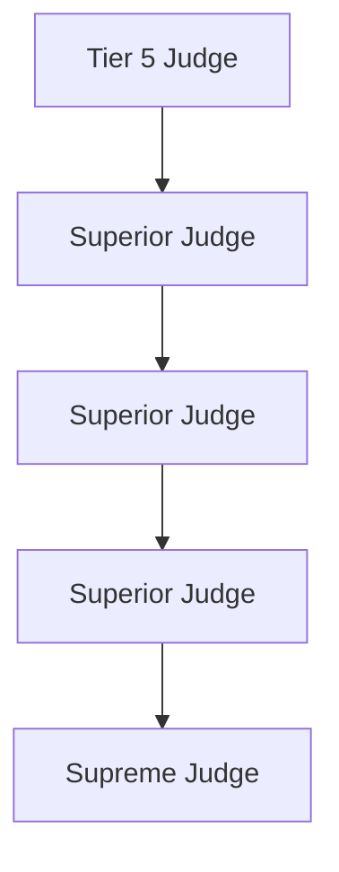
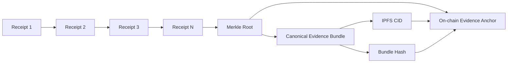

# Verdict Protocol Architecture

This document explains how Verdict Protocol works as a platform, how the current repo is structured, and how the main product flows move through the system.

It is written for three audiences:

- product/demo conversations
- engineers joining the repo
- partners/investors who need the system model quickly

## Product Summary

Verdict Protocol is a trust layer for paid AI services.

It combines:

- payment-gated AI/API calls
- cryptographically linked receipts
- evidence bundling and anchoring
- on-chain dispute resolution
- signed verdict packages
- reputation updates after rulings

In plain terms:

1. two parties enter an agreement
2. the interaction produces auditable receipts
3. evidence is bundled off-chain and anchored on-chain
4. if there is a dispute, the judge service verifies the evidence and issues a signed ruling
5. the ruling is submitted on-chain and fed into reputation

## Architecture At A Glance


## Core Components

### Agent-facing layer

- `apps/protocol_mcp`
  Exposes the protocol as MCP tools for agent runtimes.
- `packages/protocol`
  Shared client, hashing, schema validation, signing, evidence verification, and contract adapter code.
- `apps/consumer_agent`
  Example consumer-side flows for happy path and dispute path.
- `apps/provider_api`
  Example paid API protected by x402.

### Evidence layer

- `apps/evidence_service`
  Stores clauses and receipts, builds canonical bundles, pins bundles, and anchors the bundle root.
- IPFS/local bundle store
  Stores full evidence payloads off-chain.
- `foundry/src/EvidenceAnchor.sol`
  Anchors `rootHash`, `bundleHash`, and `bundleCid` on-chain.

### Contract layer

- `foundry/src/Vault.sol`
  Holds deposited funds and bonds.
- `foundry/src/JudgeRegistry.sol`
  Registers judges, tracks hierarchy, bond requirements, fee schedule, and escalation chain.
- `foundry/src/Court.sol`
  Owns agreements, disputes, evidence submission, rulings, appeals, timeouts, and settlement.

### Arbitration and reputation layer

- `apps/judge_service`
  Watches disputes, verifies evidence bundles, produces signed verdict packages, and submits rulings.
- `apps/reputation_service`
  Tracks and exposes reputation effects from outcomes.

### Operator/demo layer

- `console/`
  Canonical operator UI.
- `apps/demo_runner`
  Orchestrates end-to-end flows for demo and testing.

## Data Model

The platform revolves around five artifacts:

### 1. Clause

Defines the agreement:

- parties
- chain ID
- contract address
- service scope
- SLA rules
- dispute window
- remedy rules

### 2. Receipt

Every meaningful event in an interaction becomes a signed receipt, such as:

- request
- response
- payment
- SLA check
- dispute-related evidence

Receipts are linked by `prevHash`, forming a tamper-evident chain.

### 3. Evidence bundle

The evidence service collects:

- clause
- ordered receipts
- anchor metadata

It serializes the bundle canonically, stores it off-chain, and computes the bundle hash.

### 4. On-chain anchor

The system anchors:

- receipt Merkle root
- bundle hash
- bundle CID

This gives a lightweight, verifiable on-chain commitment without putting full evidence on-chain.

### 5. Verdict package

The judge service produces a machine-readable verdict package containing:

- dispute ID
- parties
- evidence references
- findings
- winner / loser
- transfers
- verdict hash
- judge signature
- submit tx hash

## Main Operating Modes

There are currently two architectural modes in the repo.

### Legacy monolith

Backed by:

- `contracts/AgentCourt.sol`

This is the older single-contract model. It is still relevant because parts of the Python app stack were originally built against it.

### Split v3 system

Backed by:

- `foundry/src/Vault.sol`
- `foundry/src/JudgeRegistry.sol`
- `foundry/src/Court.sol`
- `foundry/src/EvidenceAnchor.sol`

This is the cleaner architecture and the better long-term protocol shape:

- custody is separate from arbitration
- judge governance is separate from dispute execution
- evidence anchoring is separate from court logic
- appeals and timeouts can climb a real judge hierarchy

## Happy Path Flow

This is the normal paid AI-service transaction with no dispute.


### What matters on the happy path

- money is locked before trust-sensitive work starts
- the interaction is observable through signed receipts
- the evidence can be proven later even if nobody disputes immediately
- the court is available but not involved unless needed

## Dispute Flow

This is the important product path.


### What matters on the dispute path

- the ruling is based on pre-anchored evidence, not screenshots or ad hoc claims
- the judge service verifies integrity before making a decision
- the verdict package is hashable, signed, and reusable for audit
- the on-chain ruling and off-chain verdict package stay linked

## Court State Machine

This is the cleanest way to understand contract behavior.


## Judge Hierarchy

One of the main advantages of the split contract system is hierarchical arbitration.



How it works:

- each judge can have a superior
- the chain is bounded
- a dispute starts with its assigned judge
- appeals can move upward
- timeout escalation can also move upward
- if there is no superior, the ruling is final

This is much closer to a true trust-chain model than a flat single-judge system.

## Evidence Trust Model

This is the core defensibility of the product.



Why this matters:

- the receipts are linked in order
- the bundle is canonically serialized
- the bundle lives off-chain for cost and size reasons
- the chain stores the cryptographic commitment
- later, anyone can verify whether a presented bundle matches the anchored commitment

## MCP View

For agent-native adoption, the best mental model is:

- agents do not need to hand-write Web3 calls
- they call MCP tools
- the MCP server translates those tool calls into protocol actions

Current MCP-style actions include:

- create agreement
- accept agreement
- complete agreement
- anchor agreement evidence
- file dispute
- get dispute
- process dispute
- register judge

That means an autonomous agent can participate in Verdict Protocol using standard tool-calling patterns instead of custom blockchain integration.

## Console / Operator View

The console exists for human operators, demos, and debugging.

It shows:

- environment and contract mode
- runs and service status
- disputes and verdicts
- agreement explorer
- receipt chain viewer
- evidence export bundle

The console is not the protocol itself. It is the operational surface over the protocol.

## How The Repo Maps To The Platform

### Contract source of truth

- split v3: `foundry/src/*`
- legacy monolith: `contracts/*`

### Shared protocol primitives

- `packages/protocol/src/verdict_protocol/*`

### Services

- evidence: `apps/evidence_service`
- judge: `apps/judge_service`
- reputation: `apps/reputation_service`
- provider demo API: `apps/provider_api`
- demo orchestration: `apps/demo_runner`
- MCP server: `apps/protocol_mcp`

### Frontend

- canonical UI: `console/`

## Current Working Story In This Repo

Today, the repo can demonstrate:

- agreement creation
- receipt generation
- IPFS-style evidence bundling
- on-chain evidence anchoring
- dispute filing
- deterministic judge processing
- signed verdict package generation
- ruling submission

The new split-local path now works end-to-end through:

```bash
bash ./scripts/demo.sh --split-local --dispute
```

That flow boots:

- local Anvil
- local split contracts
- local services
- console

And it completes with:

- a live split `Court` dispute
- anchored evidence bundle
- a signed submitted verdict

## Recommended Visualization For Decks

If this needs to be shown to investors or partners, use four slides:

1. System map
   Show agents, protocol services, contracts, IPFS, and console.
2. Happy path
   Show payment, receipts, anchoring, completion.
3. Dispute path
   Show evidence verification, judge ruling, on-chain submission.
4. Court hierarchy
   Show why the system is more than escrow and more than logging.

That sequence tells the right story:

- first, this is programmable trust infrastructure
- second, it works on normal transactions
- third, it becomes valuable when things go wrong
- fourth, the architecture compounds into reputation and governance

## Short Version

Verdict Protocol turns paid AI interactions into verifiable contracts:

- economic stake is locked
- execution is recorded as signed receipts
- evidence is bundled off-chain and anchored on-chain
- disputes are resolved against tamper-evident evidence
- signed verdicts feed reputation

That is the platform in one sentence.
