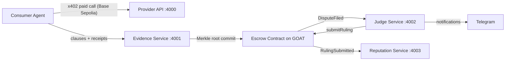

# Agent Court — On-Chain Dispute Resolution for AI Agents

Agent Court is a fully on-chain judicial system for autonomous AI agents. When agents transact and disputes arise, Agent Court provides escrow, evidence, and tiered AI judges that issue formal rulings enforced by smart contract.

- **Contract**: `0xFBf9b5293A1737AC53880d3160a64B49bA54801D` on GOAT Testnet3 (`chainId=48816`)
- **Payments**: USDC ERC-20 (`0x29d1ee93e9ecf6e50f309f498e40a6b42d352fa1`)
- **Identity**: ERC-8004 enforced — agents must have on-chain identity to participate
- **Reputation**: ERC-8004 `giveFeedback()` called after every ruling
- **Judge tiers**: District (Haiku, $0.05) → Appeals (Sonnet, $0.10) → Supreme (Opus, $0.20)
- x402 API payments run on **Base Sepolia** (`eip155:84532`) with USDC.

## Architecture



## Repository Layout

- `packages/protocol`: shared schemas, canonical JSON, hashing, signature verification, receipt chain verification, escrow adapter.
- `apps/evidence_service`: clause/receipt storage + anchoring API.
- `apps/provider_api`: x402-protected API endpoint.
- `apps/consumer_agent`: happy/dispute path scripts.
- `apps/judge_service`: dispute watcher, verification, deterministic/LLM verdicting, on-chain ruling.
- `apps/reputation_service`: event watcher + reputation API.
- `apps/demo_runner`: end-to-end orchestrator.
- `contracts`: existing L1 contract, ABI, and optional deploy tooling.
- `demo/` and `guardian/` (legacy from early python-backend): optional manual demo scripts and proxy tooling retained for reference/backward compatibility; the authoritative runtime for hackathon validation remains the `apps/*` services.

## Prerequisites

- Python 3.11+
- `uv` (workspace and run commands)
- GOAT test BTC for judge/provider/consumer wallets
- Base Sepolia test USDC for consumer wallet (x402)
- Optional: Anthropic API key, Telegram bot token

## Environment

Copy and fill:

```bash
cp .env.example .env
```

Required important values:

- `GOAT_RPC_URL=https://rpc.testnet3.goat.network`
- `GOAT_CHAIN_ID=48816`
- `ESCROW_CONTRACT_ADDRESS=...`
- `JUDGE_PRIVATE_KEY`, `PROVIDER_PRIVATE_KEY`, `CONSUMER_PRIVATE_KEY`
- `X402_FACILITATOR_URL=https://www.x402.org/facilitator`
- `X402_NETWORK=eip155:84532`
- `X402_SELLER_WALLET=...`

### GOAT x402 merchant credentials (very important)

For GOAT marketplace onboarding and dashboard flows, keep these values in a local, untracked env file (backend only):

- `GOATX402_API_URL`
- `GOATX402_MERCHANT_ID`
- `GOATX402_API_KEY`
- `GOATX402_API_SECRET`

**Critical:** `GOATX402_API_SECRET` is backend-only. Never expose it in frontend code, logs, or commits.

An operator file is stored as:

- `.env.local`

For this session:

- `GOATX402_API_URL=https://x402-api-lx58aabp0r.testnet3.goat.network`
- `GOATX402_MERCHANT_ID=verdict_protocol`
- `GOATX402_AGENT_ID=33`
- `GOATX402_DASHBOARD_URL=https://goat-dashboard.vercel.app`
- `GOATX402_TX_URL=https://explorer.testnet3.goat.network/tx/0xdc93bc2455ca79daf07d12b2972ef4b01c04587683ffed044a173a0669bd7456`

Load before running backend services:

```bash
set -a
source .env.local
set +a
```

For local no-chain dry runs:

- `ESCROW_DRY_RUN=1`
- `X402_ALLOW_MOCK=1`

For a live GOAT dashboard payment push:

- `DASHBOARD_PAYMENT_PRIVATE_KEY` (or fallback to `CONSUMER_PRIVATE_KEY`)
- `DASHBOARD_PAYMENT_TOKEN=USDC` (or `USDT`)
- `DASHBOARD_PAYMENT_AMOUNT=0.001`
- `DASHBOARD_REGISTER_AGENT=1` to register/update sender identity label
- `DASHBOARD_AGENT_NAME="Ayush + Karan and Verdict Protocol"`
- Optional `DASHBOARD_AGENT_RECIPIENT` to force destination agent wallet
- Optional `DASHBOARD_REQUEST_FAUCET=1` with `GOAT_FAUCET_TURNSTILE_TOKEN=...`

## Install

```bash
uv sync
```

## Run Services Individually

```bash
uv run --package evidence-service evidence-service
uv run --package provider-api provider-api
uv run --package judge-service judge-service
uv run --package reputation-service reputation-service
```

Optional pnpm wrappers:

```bash
pnpm dev:evidence
pnpm dev:provider
pnpm dev:judge
pnpm dev:reputation
```

Push a transfer into GOAT dashboard `Agent ↔ Agent Payments`:

```bash
PYTHONPATH=apps/demo_runner/src uv run python -m demo_runner.push_dashboard_payment
# or
pnpm dashboard:payment
```

The script sends a GOAT Testnet3 USDC/USDT transfer and checks the same token-transfer
feed that powers [goat-dashboard.vercel.app](https://goat-dashboard.vercel.app/).
When `DASHBOARD_REGISTER_AGENT=1`, it first calls ERC-8004 `register(string)` with
metadata so the dashboard can show your custom label.
If `DASHBOARD_REQUEST_FAUCET=1`, it calls `https://bridge-api.testnet3.goat.network/api/faucet`
first (requires a valid Cloudflare Turnstile token).

## Run Demo

```bash
uv run demo
# or
pnpm demo
```

The demo runs:

1. Happy path flow
2. Dispute path flow
3. Summary output with tx hashes, receipt IDs, anchor root, and reputation standings

## Run Tests

```bash
uv run pytest
# or
pnpm test
```

## API Overview

### Evidence Service (:4001)

- `POST /clauses`
- `POST /receipts`
- `GET /receipts?agreementId=&actorId=`
- `GET /receipts/{receiptId}`
- `POST /anchor`
- `GET /clauses/{agreementId}`
- `GET /anchors?agreementId=`
- `GET /anchors/by-root/{rootHash}`

### Provider API (:4000)

- `GET /api/data`
- `GET /api/data?bad=true`

Returns `X-Evidence-Hash` response header for receipt metadata binding.

### Reputation API (:4003)

- `GET /reputation/{actorId}`
- `GET /reputation`

## ABI Compatibility Notes

The escrow adapter (`packages/protocol/src/verdict_protocol/escrow_client.py`) is dual-compatible:

- Target-style methods (`depositPool`, `postBond`, `commitEvidenceHash`) when available.
- Current `AgentCourt` methods (`deposit`, `commitEvidence`, `fileDispute(address,uint256,bytes32)`, `submitRuling(uint256,address)`) as fallback mappings.

Current local `AgentCourt.sol` does not expose:

- `depositPool`
- `postBond`
- `commitEvidenceHash(agreementId, rootHash)`
- structured `submitRuling(disputeId, verdictData)`

Fallback behavior is documented and implemented in adapter methods.

If `ESCROW_CONTRACT_ADDRESS` has no deployed bytecode (for example the provided
`0x00289Dbbb86b64881CEA492D14178CF886b066Be` at planning time), use
`contracts/scripts/deploy.ts` on `goat-testnet3` and update `.env`.

## Network Links

- GOAT docs: https://docs.goat.network/builders/quick-start
- GOAT network details: https://docs.goat.network/network/networks-rpc
- GOAT explorer: https://explorer.testnet3.goat.network
- GOAT faucet/bridge: https://bridge.testnet3.goat.network
- x402 quickstart: https://docs.cdp.coinbase.com/x402/quickstart-for-sellers
- x402 facilitator: https://www.x402.org/facilitator
- x402 Python package: https://pypi.org/project/x402/
- Base Sepolia USDC faucet: https://portal.cdp.coinbase.com/products/faucet
