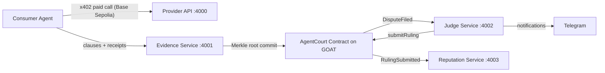

# Verdict Protocol — The Trust Layer for Paid AI Services

Verdict Protocol adds payment-gated access, verifiable execution evidence, and dispute resolution to any API or agent workflow. Agent Court is the arbitration engine that resolves disputes with tiered AI judges.

- **Contract**: `0xFBf9b5293A1737AC53880d3160a64B49bA54801D` on GOAT Testnet3 (`chainId=48816`)
- **Payments**: USDC ERC-20 (`0x29d1ee93e9ecf6e50f309f498e40a6b42d352fa1`)
- **Identity**: ERC-8004 enforced — agents must have on-chain identity to participate
- **Reputation**: ERC-8004 `giveFeedback()` called after every ruling
- **Agent Court tiers**: District (Haiku, $0.05) → Appeals (Sonnet, $0.10) → Supreme (Opus, $0.20)
- x402 API payments run on **Base Sepolia** (`eip155:84532`) with USDC.

## Architecture


```mermaid
flowchart LR
  C["Consumer Agent"] -->|"x402 paid call (Base Sepolia)"| P["Provider API :4000"]
  C -->|"clauses + receipts"| E["Evidence Service :4001"]
  E -->|"Merkle root commit"| L1["AgentCourt Contract on GOAT"]
  L1 -->|"DisputeFiled"| J["Judge Service :4002"]
  J -->|"submitRuling"| L1
  L1 -->|"RulingSubmitted"| R["Reputation Service :4003"]
  J -->|"notifications"| T["Telegram"]
```

## Repository Layout

### Canonical runtime (`apps/*` + `packages/protocol/`)

- `packages/protocol/`: shared schemas, canonical JSON, hashing, signature verification, receipt chain verification, escrow adapter.
- `apps/evidence_service/`: clause/receipt storage + anchoring API (port 4001).
- `apps/provider_api/`: x402-protected API endpoint (port 4000).
- `apps/consumer_agent/`: happy/dispute path scripts.
- `apps/judge_service/`: dispute watcher, verification, deterministic/LLM verdicting, on-chain ruling (port 4002).
- `apps/reputation_service/`: event watcher + reputation API (port 4003).
- `apps/demo_runner/`: end-to-end orchestrator (port 4004).
- `contracts/`: AgentCourt.sol, ABI, and deploy tooling.

### Console

- `console/`: canonical operator dashboard (single-page application).

### Legacy (archived reference)

- `_legacy/server/`: early Python backend.
- `_legacy/demo/`: pre-services era demo scripts.
- `_legacy/guardian/`: proxy reference implementation.
- `_legacy/judge-frontend/`: original static dashboard before consolidation into `console/`.
- `_legacy/verdict-frontend/`: React rewrite (archived — console is canonical).

## Project Management

- `PRODUCT_PLAN.md`: strategic product source of truth
- `Verdict_Comprehensive_Task_Division.md`: execution backlog, ownership, dependencies, and status
- `docs/two_person_execution_plan.md`: current two-developer staffing and handoff model
- `docs/project_management_rules.md`: operating rules
- `docs/completion.md`: rollup tracker
- `docs/changes.md`: deviation log
- `docs/runbooks/demo-runbook.md`: stable demo flow and presenter fallback path

## Prerequisites

- Python 3.11+
- `uv` (workspace and run commands)
- GOAT test BTC for judge/provider/consumer wallets
- Base Sepolia test USDC for consumer wallet (x402)
- Optional: Anthropic API key, Telegram bot token

## Environment

Copy and fill:

```bash
cp .env.example .env
```

Required values:

- `GOAT_RPC_URL=https://rpc.testnet3.goat.network`
- `GOAT_CHAIN_ID=48816`
- `ESCROW_CONTRACT_ADDRESS=...`
- `JUDGE_PRIVATE_KEY`, `PROVIDER_PRIVATE_KEY`, `CONSUMER_PRIVATE_KEY`
- `X402_FACILITATOR_URL=https://www.x402.org/facilitator`
- `X402_NETWORK=eip155:84532`
- `X402_SELLER_WALLET=...`

### GOAT x402 merchant credentials

For GOAT marketplace onboarding and dashboard flows, keep these values in `.env.local` (backend only, untracked):

- `GOATX402_API_URL`
- `GOATX402_MERCHANT_ID`
- `GOATX402_API_KEY`
- `GOATX402_API_SECRET`

**Critical:** `GOATX402_API_SECRET` is backend-only. Never expose it in frontend code, logs, or commits.

Load before running backend services:

```bash
set -a
source <(grep -E '^(export[[:space:]]+)?[A-Za-z_][A-Za-z0-9_]*=.*$' .env.local)
set +a
```

### Mock mode (local development)

For local no-chain dry runs:

- `ESCROW_DRY_RUN=1`
- `X402_ALLOW_MOCK=1`

When mock mode is active, the console displays a prominent banner and the environment panel shows `MOCK` status. No real funds are at risk.

The demo bootstrap also resets the local mock SQLite state by default so every demo starts from a clean slate. Set `DEMO_RESET_STATE=0` if you intentionally want to keep prior mock runs.

## Install

```bash
uv sync
```

## Run Services

```bash
pnpm dev:evidence
pnpm dev:provider
pnpm dev:judge
pnpm dev:reputation
pnpm dev:runner
```

Or directly from source:

```bash
bash ./scripts/run_module.sh evidence_service.server
bash ./scripts/run_module.sh provider_api.server
bash ./scripts/run_module.sh judge_service.server
bash ./scripts/run_module.sh reputation_service.api
bash ./scripts/run_module.sh demo_runner.server
```

## Run Demo

```bash
./scripts/demo.sh
# optional: --console, --happy, --dispute, --live
```

Quick aliases:

```bash
pnpm demo
pnpm demo:console
pnpm demo:happy
pnpm demo:dispute
```

The default demo run boots the services, starts the demo runner and console, then executes:
1. Happy path flow
2. Dispute path flow
3. Summary output with tx hashes, receipt IDs, anchor root, submitted verdict, and reputation standings

For a presenter-friendly flow, use `pnpm demo:console`, open the console, and trigger `happy` / `dispute` runs from the Control Panel.

## Run Console

```bash
pnpm demo:ui
# or
python3 -m http.server 4173 --directory console
```

The console provides:
- **Control Panel**: run orchestration (happy/dispute/full modes), service health, environment status
- **Agent Court**: verdicts, disputes, and reputation leaderboard
- **Network Explorer**: agreement explorer with receipt chain visualization

## Run Tests

```bash
uv run pytest
# or
pnpm test
```

## API Overview

### Evidence Service (:4001)

- `POST /clauses` — register arbitration clause
- `POST /receipts` — store event receipt
- `GET /receipts?agreementId=&actorId=` — query receipts
- `GET /agreements/{agreementId}` — full agreement view
- `POST /anchor` — commit Merkle root on-chain
- `GET /anchors/by-root/{rootHash}` — verify anchoring

### Provider API (:4000)

- `GET /api/data` — x402-protected endpoint
- `GET /api/data?bad=true` — intentionally bad response (testing)

Returns `X-Evidence-Hash` response header for receipt binding.

### Judge Service (:4002)

- `GET /health` — service health + contract sanity
- `GET /verdicts` — list all verdicts
- `GET /verdicts/{disputeId}` — single verdict with opinion

### Reputation Service (:4003)

- `GET /reputation` — leaderboard
- `GET /reputation/{actorId}` — agent reputation

## Network Links

- GOAT docs: https://docs.goat.network/builders/quick-start
- GOAT explorer: https://explorer.testnet3.goat.network
- GOAT faucet/bridge: https://bridge.testnet3.goat.network
- x402 quickstart: https://docs.cdp.coinbase.com/x402/quickstart-for-sellers
- x402 facilitator: https://www.x402.org/facilitator
- Base Sepolia USDC faucet: https://portal.cdp.coinbase.com/products/faucet
