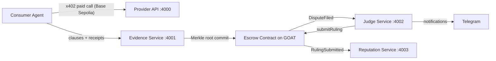

# Agent Court — On-Chain Dispute Resolution for AI Agents

Agent Court is a fully on-chain judicial system for autonomous AI agents. When agents transact and disputes arise, Agent Court provides escrow, evidence, and tiered AI judges that issue formal rulings enforced by smart contract.

- **Contract**: `0xFBf9b5293A1737AC53880d3160a64B49bA54801D` on GOAT Testnet3 (`chainId=48816`)
- **Payments**: USDC ERC-20 (`0x29d1ee93e9ecf6e50f309f498e40a6b42d352fa1`)
- **Identity**: ERC-8004 enforced — agents must have on-chain identity to participate
- **Reputation**: ERC-8004 `giveFeedback()` called after every ruling
- **Judge tiers**: District (Haiku, $0.05) → Appeals (Sonnet, $0.10) → Supreme (Opus, $0.20)
- x402 API payments run on **Base Sepolia** (`eip155:84532`) with USDC.

## Architecture


```mermaid
flowchart LR
  C["Consumer Agent"] -->|"x402 paid call (Base Sepolia)"| P["Provider API :4000"]
  C -->|"clauses + receipts"| E["Evidence Service :4001"]
  E -->|"Merkle root commit"| L1["Escrow Contract on GOAT"]
  L1 -->|"DisputeFiled"| J["Judge Service :4002"]
  J -->|"submitRuling"| L1
  L1 -->|"RulingSubmitted"| R["Reputation Service :4003"]
  J -->|"notifications"| T["Telegram"]
```

## Repository Layout

- `packages/protocol`: shared schemas, canonical JSON, hashing, signature verification, receipt chain verification, escrow adapter.
- `apps/evidence_service`: clause/receipt storage + anchoring API.
- `apps/provider_api`: x402-protected API endpoint.
- `apps/consumer_agent`: happy/dispute path scripts.
- `apps/judge_service`: dispute watcher, verification, deterministic/LLM verdicting, on-chain ruling.
- `apps/reputation_service`: event watcher + reputation API.
- `apps/demo_runner`: end-to-end orchestrator.
- `apps/protocol_mcp`: stdio MCP server so agents can create agreements, anchor evidence, file disputes, and process cases through tool calls.
- `console`: canonical operator dashboard and demo UI.
- `contracts`: legacy monolithic Hardhat contract, ABI, and deploy tooling used by the current Python runtime.
- `foundry`: new split contract workspace (`Vault`, `JudgeRegistry`, `Court`) for the hierarchical v3 court system.
- `judge-frontend/`: legacy compatibility frontend host retained for backward compatibility.
- `demo/` and `guardian/` (legacy from early python-backend): optional manual demo scripts and proxy tooling retained for reference/backward compatibility; the authoritative runtime for hackathon validation remains the `apps/*` services plus `console/`.

## Remote Integration (Non-Breaking)

Recent `origin/main` updates were integrated additively without replacing the current frontend flow:

- Added compatibility aliases in judge service:
  - `/api/health`
  - `/api/verdicts`
  - `/api/verdicts/{disputeId}`
- Added optional legacy compatibility helpers under `judge-frontend/`:
  - `verdict_api.py` (shim to judge service verdict endpoints)
  - `court_server.py` (frontend host + API proxy adapter)
  - `court_watcher.py` (compatibility watcher)
- Added `console/` as the canonical static dashboard path used by the demo bootstrap and pnpm frontend scripts.
- Added `agent_demo.py` as a safe runner-driven demo script (no embedded keys).
- Added `KNOWN_ISSUES.md` with current limitations and priorities.
- Added `foundry/` as the new split contract system for the next protocol iteration, without breaking the current monolithic runtime.

## Prerequisites

- Python 3.11+
- `uv` (workspace and run commands)
- GOAT test BTC for judge/provider/consumer wallets
- Base Sepolia test USDC for consumer wallet (x402)
- Optional: Anthropic API key, Telegram bot token

## Environment

Copy and fill:

```bash
cp .env.example .env
```

Required important values:

- `GOAT_RPC_URL=https://rpc.testnet3.goat.network`
- `GOAT_CHAIN_ID=48816`
- `ESCROW_CONTRACT_ADDRESS=...`
- `JUDGE_PRIVATE_KEY`, `PROVIDER_PRIVATE_KEY`, `CONSUMER_PRIVATE_KEY`
- optional: `EVIDENCE_SIGNER_PRIVATE_KEY` if you want the evidence service to anchor with a separate operator wallet
- `X402_FACILITATOR_URL=https://www.x402.org/facilitator`
- `X402_NETWORK=eip155:84532`
- `X402_SELLER_WALLET=...`

### Split v3 contract mode

The default app runtime still targets `contracts/AgentCourt.sol`.

To exercise the new Foundry v3 contract layout instead, set:

- `ESCROW_CONTRACT_MODE=split`
- `ESCROW_COURT_ADDRESS=...`
- `ESCROW_VAULT_ADDRESS=...`
- `ESCROW_JUDGE_REGISTRY_ADDRESS=...`
- `ESCROW_EVIDENCE_ANCHOR_ADDRESS=...`
- Optional IPFS env:
  - `IPFS_MODE=local|pinata|auto`
  - `IPFS_LOCAL_STORE_PATH=./data/ipfs`
  - `IPFS_PINATA_JWT=...`
  - `IPFS_GATEWAY_BASE_URL=...`

Current split-mode behavior on `main`:

- consumer flows can create and accept `Court` contracts and carry the Court contract ID into disputes
- split-mode deposits now auto-approve the Vault’s USDC spend before moving funds into bond
- `EscrowClient.register_judge(...)` can pre-bond a judge and register it against `JudgeRegistry`
- judge service can resolve the assigned judge per dispute instead of relying on one global judge address
- evidence service can build and pin canonical evidence bundles, then anchor the Merkle root plus bundle hash through `EvidenceAnchor` when configured
- `apps/protocol_mcp` exposes the protocol as MCP tools over stdio for agent runtimes, including `register_judge` and `complete_agreement`

Current split-mode limitation:

- if `ESCROW_EVIDENCE_ANCHOR_ADDRESS` is not configured, `/anchor` falls back to `anchorMode=offchain_bundle`

Local split stack bootstrap:

```bash
bash ./scripts/demo.sh --split-local --dispute
```

`--split-local` now bootstraps the local Anvil RPC automatically, deploys `MockUSDC` plus the split `Vault` / `JudgeRegistry` / `Court` / `EvidenceAnchor` stack, writes `.env.split.local`, and pre-registers the local judge account before starting the app services.

### GOAT x402 merchant credentials (very important)

For GOAT marketplace onboarding and dashboard flows, keep these values in a local, untracked env file (backend only):

- `GOATX402_API_URL`
- `GOATX402_MERCHANT_ID`
- `GOATX402_API_KEY`
- `GOATX402_API_SECRET`

**Critical:** `GOATX402_API_SECRET` is backend-only. Never expose it in frontend code, logs, or commits.

An operator file is stored as:

- `.env.local`

For this session:

- `GOATX402_API_URL=https://x402-api-lx58aabp0r.testnet3.goat.network`
- `GOATX402_MERCHANT_ID=verdict_protocol`
- `GOATX402_AGENT_ID=33`
- `GOATX402_DASHBOARD_URL=https://goat-dashboard.vercel.app`
- `GOATX402_TX_URL=https://explorer.testnet3.goat.network/tx/0xdc93bc2455ca79daf07d12b2972ef4b01c04587683ffed044a173a0669bd7456`

Load before running backend services:

```bash
set -a
source .env.local
set +a
```

For local no-chain dry runs:

- `ESCROW_DRY_RUN=1`
- `X402_ALLOW_MOCK=1`

For a live GOAT dashboard payment push:

- `DASHBOARD_PAYMENT_PRIVATE_KEY` (or fallback to `CONSUMER_PRIVATE_KEY`)
- `DASHBOARD_PAYMENT_TOKEN=USDC` (or `USDT`)
- `DASHBOARD_PAYMENT_AMOUNT=0.001`
- `DASHBOARD_REGISTER_AGENT=1` to register/update sender identity label
- `DASHBOARD_AGENT_NAME="Ayush + Karan and Verdict Protocol"`
- Optional `DASHBOARD_AGENT_RECIPIENT` to force destination agent wallet
- Optional `DASHBOARD_REQUEST_FAUCET=1` with `GOAT_FAUCET_TURNSTILE_TOKEN=...`

## Install

```bash
uv sync
```

## Run Services Individually

```bash
bash ./scripts/run_module.sh evidence_service.server
bash ./scripts/run_module.sh provider_api.server
bash ./scripts/run_module.sh judge_service.server
bash ./scripts/run_module.sh reputation_service.api
bash ./scripts/run_module.sh demo_runner.server
uv run python -m protocol_mcp.server
```

Optional pnpm wrappers:

```bash
pnpm dev:evidence
pnpm dev:provider
pnpm dev:judge
pnpm dev:reputation
pnpm dev:runner
pnpm dev:mcp
```

Push a transfer into GOAT dashboard `Agent ↔ Agent Payments`:

```bash
PYTHONPATH=apps/demo_runner/src uv run python -m demo_runner.push_dashboard_payment
# or
pnpm dashboard:payment
```

The script sends a GOAT Testnet3 USDC/USDT transfer and checks the same token-transfer
feed that powers [goat-dashboard.vercel.app](https://goat-dashboard.vercel.app/).
When `DASHBOARD_REGISTER_AGENT=1`, it first calls ERC-8004 `register(string)` with
metadata so the dashboard can show your custom label.
If `DASHBOARD_REQUEST_FAUCET=1`, it calls `https://bridge-api.testnet3.goat.network/api/faucet`
first (requires a valid Cloudflare Turnstile token).

## Run Demo

```bash
bash ./scripts/demo.sh
pnpm demo
```

Useful modes:

```bash
pnpm demo:console
pnpm demo:happy
pnpm demo:dispute
```

The demo bootstrap starts the local services, opens the console on `:4173`, and runs:

1. Happy path flow
2. Dispute path flow
3. Summary output with tx hashes, receipt IDs, anchor root, submitted verdict, and reputation standings

## Run Tests

```bash
uv run pytest
# or
pnpm test
```

## API Overview

### Evidence Service (:4001)

- `POST /clauses`
- `POST /receipts`
- `GET /receipts?agreementId=&actorId=`
- `GET /receipts/{receiptId}`
- `POST /anchor`
- `GET /clauses/{agreementId}`
- `GET /anchors?agreementId=`
- `GET /anchors/by-root/{rootHash}`

### Provider API (:4000)

- `GET /api/data`
- `GET /api/data?bad=true`

Returns `X-Evidence-Hash` response header for receipt metadata binding.

### Reputation API (:4003)

- `GET /reputation/{actorId}`
- `GET /reputation`

## ABI Compatibility Notes

The escrow adapter (`packages/protocol/src/verdict_protocol/escrow_client.py`) is dual-compatible:

- Target-style methods (`depositPool`, `postBond`, `commitEvidenceHash`) when available.
- Current `AgentCourt` methods (`deposit`, `commitEvidence`, `fileDispute(address,uint256,bytes32)`, `submitRuling(uint256,address)`) as fallback mappings.

Current local `AgentCourt.sol` does not expose:

- `depositPool`
- `postBond`
- `commitEvidenceHash(agreementId, rootHash)`
- structured `submitRuling(disputeId, verdictData)`

Fallback behavior is documented and implemented in adapter methods.

If `ESCROW_CONTRACT_ADDRESS` has no deployed bytecode (for example the provided
`0x00289Dbbb86b64881CEA492D14178CF886b066Be` at planning time), use
`contracts/scripts/deploy.ts` on `goat-testnet3` and update `.env`.

## Network Links

- GOAT docs: https://docs.goat.network/builders/quick-start
- GOAT network details: https://docs.goat.network/network/networks-rpc
- GOAT explorer: https://explorer.testnet3.goat.network
- GOAT faucet/bridge: https://bridge.testnet3.goat.network
- x402 quickstart: https://docs.cdp.coinbase.com/x402/quickstart-for-sellers
- x402 facilitator: https://www.x402.org/facilitator
- x402 Python package: https://pypi.org/project/x402/
- Base Sepolia USDC faucet: https://portal.cdp.coinbase.com/products/faucet
